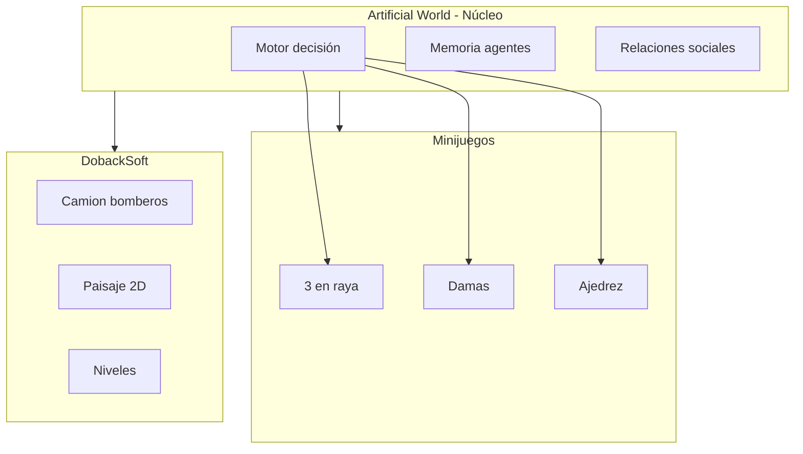

# Roadmap técnico — Artificial World

Plan de implementación por fases para minijuegos, DobackSoft y el ecosistema integrado.

---

## Arquitectura propuesta



---

## Fases de implementación

### Fase 1 — Estado actual (completada)

| Entregable | Estado |
|------------|--------|
| Simulación de agentes (Pygame) | OK |
| Demo HTML (artificial-world.html) | OK |
| App ejecutable Windows | OK |
| Motor de decisión, memoria, relaciones | OK |
| Modo Sombra, persistencia SQLite | OK |

---

### Fase 2a — Minijuegos base

| Entregable | Descripción | Dependencias |
|------------|-------------|--------------|
| 3 en raya (HTML/JS) | Juego funcional en navegador | Ninguna |
| Lógica PvP | Dos jugadores en la misma sesión | WebSocket o servidor de partidas |
| Integración IA (opcional) | Bot que usa evaluación de tablero | Motor de decisión (adaptado) |

**Stack sugerido:** HTML5, CSS, JavaScript vanilla o framework ligero. Sin backend inicial: PvP local (mismo dispositivo).

**Estructura de archivos:**
```
docs/
  minijuegos/
    tres-en-raya/
      index.html
      game.js
      styles.css
```

---

### Fase 2b — Minijuegos ampliados

| Entregable | Descripción | Dependencias |
|------------|-------------|--------------|
| Damas | Reglas completas, tablero 8x8 | Fase 2a |
| Ajedrez | Reglas completas, piezas | Fase 2a |
| Modo PvAI | IA que usa motor de decisión | API o WASM del motor |

**Consideraciones:**
- IA para damas: evaluación de tablero (piezas, posición, coronaciones)
- IA para ajedrez: minimax + evaluación; puede ser versión simplificada
- Motor de decisión: exponer vía API (FastAPI) o compilar a WASM para cliente

---

### Fase 3a — DobackSoft MVP

| Entregable | Descripción | Dependencias |
|------------|-------------|--------------|
| Prototipo 2D | Camión, mapa, objetivo | Ninguna |
| Controles | Acelerar, frenar, girar | - |
| Física básica | Movimiento, colisiones | - |
| Objetivo | Llegar a punto de emergencia | - |

**Stack sugerido:** Pygame (reutilizar stack) o web (Phaser/Phaser.js, PixiJS).

**Estructura de archivos:**
```
dobacksoft/
  main.py          # o index.html si es web
  camion.py
  mapa.py
  fisica.py
```

---

### Fase 3b — DobackSoft completo

| Entregable | Descripción | Dependencias |
|------------|-------------|--------------|
| Niveles | Múltiples escenarios | Fase 3a |
| Objetos | Semáforos, peatones, tráfico | Fase 3a |
| Obstáculos | Edificios, calles cerradas | Fase 3a |
| Paisaje realista | Gráficos, iluminación | Fase 3a |

---

### Fase 4 — Integración

| Entregable | Descripción | Dependencias |
|------------|-------------|--------------|
| Hub / Lobby | Página que enlaza todas las experiencias | Fases 2 y 3 |
| Navegación | Enlaces a Artificial World, minijuegos, DobackSoft | - |
| Autenticación (futuro) | Usuarios, progreso compartido | Backend |
| Progreso compartido (futuro) | Estadísticas, logros entre experiencias | Backend |

**Estructura del hub:**
```
docs/
  index.html       # Landing principal
  artificial-world.html
  minijuegos/
    index.html     # Hub minijuegos
    tres-en-raya/
    damas/
    ajedrez/
  dobacksoft/
    index.html     # O enlace a app Pygame
```

---

## Consideraciones técnicas

### Minijuegos

| Aspecto | Opción |
|---------|--------|
| Render | HTML5 Canvas o DOM (tablero como grid) |
| PvP | WebSocket (Socket.io, ws) o servidor de partidas |
| PvAI | Motor en API (FastAPI) o WASM (Pyodide) en cliente |
| Hosting | GitHub Pages (estático) + servidor externo para PvP |

### DobackSoft

| Aspecto | Opción |
|---------|--------|
| Plataforma | Pygame (reutilizar) o web (Phaser, PixiJS) |
| Assets | Sprites 2D, tilesets para paisaje |
| Física | Módulo propio o Box2D (Pygame) |

### Mundo contenedor

| Aspecto | Opción |
|---------|--------|
| Hub | Página HTML con enlaces a cada experiencia |
| Autenticación | Futuro: Auth0, Firebase, Supabase |
| Progreso | Futuro: base de datos, API |

---

## Dependencias entre fases

```
Fase 1 (actual) ──────────────────────────────────────────┐
                                                          │
Fase 2a (3 en raya) ──────┬── Fase 2b (damas, ajedrez)   │
                           │                              │
Fase 3a (DobackSoft MVP) ─┼── Fase 3b (DobackSoft full)  │
                           │                              │
                           └──────────────────────────────┼── Fase 4 (integración)
                                                          │
                                                          └── Hub
```

---

## Próximos pasos inmediatos

1. **Fase 2a:** Crear `docs/minijuegos/tres-en-raya/` con 3 en raya jugable (PvP local)
2. **Fase 3a:** Crear carpeta `dobacksoft/` con prototipo de camión y mapa básico
3. **Fase 4:** Actualizar `docs/index.html` como hub con enlaces a cada experiencia
