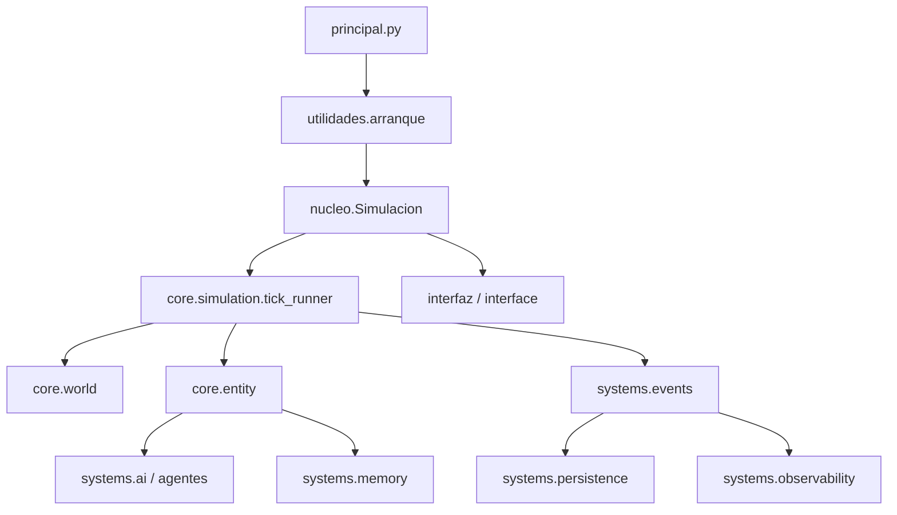

# Arquitectura de Artificial World

Documento de arquitectura para desarrolladores. Permite entender el proyecto en ~10 minutos.

## Qué es Artificial World

**Artificial World** es una simulación de vida artificial 2D con agentes autónomos. Las entidades toman decisiones por utilidad, reaccionan al entorno y pueden ser controladas mediante Modo Sombra (control manual de una entidad).

- **Motor**: Python 3.11+ con pygame
- **Modelo**: mundo persistente, grid 2D, entidades con hambre/energía, recursos, refugios
- **IA**: decisión por utilidad (sin LLMs), memoria espacial y social, relaciones dinámicas

## Sistemas principales



### 1. World (core.world)

- **Mapa**: grid 2D de celdas
- **Celda**: posición, terreno, recurso opcional, refugio opcional, entidades presentes
- **Recurso**: comida o material
- **Zona**: agrupación semántica de posiciones (estructura preparada)
- **GeneradorMundo**: crea mapa inicial y distribuye recursos y refugios

Rutas: `core/world/`, reexportado por `mundo/`.

### 2. Shelter (core.shelter)

- **Refugio**: zona segura con bonus de descanso
- Estructura preparada para: espacio 20x20, propietario, objetos, memoria local, entidades residentes
- Constante `SHELTER_SIZE = 20`

Rutas: `core/shelter/`, reexportado por `mundo.refugio`.

### 3. Entity (core.entity)

- **EntidadBase**: clase base con estado interno, memoria, motor de decisión, directivas
- **EntidadSocial**: entidad con relaciones y rasgos sociales
- **EntidadGato**: entidad no humana con prioridades distintas
- **FabricaEntidades**: crea entidades iniciales y las coloca en el mapa

Rutas: `core/entity/`, reexportado por `entidades/`.

### 4. Memory / Events (systems.memory, systems.events)

- **MemoriaEntidad**: recuerdos espaciales (recursos, refugios), sociales, eventos recientes
- **BusEventos**: cola de eventos; las acciones emiten eventos que consumen logs y métricas

Rutas: `systems/memory/`, `systems/events/`; reexportados por `agentes.memoria` y `nucleo.bus_eventos`.

### 5. Simulation Loop (core.simulation)

- **ejecutar_tick(sim)**: ejecuta un tick completo sin depender de la interfaz
- **Simulacion**: orquesta mundo, entidades, UI, persistencia, watchdog
- **GestorTicks**: contador de ticks
- **ContextoDecision / ContextoSimulacion**: contextos para decisión y ejecución de acciones

Rutas: `core/simulation/tick_runner.py`, `nucleo/simulacion.py`.

## Cómo interactúan

1. **Arranque**: `principal.py` → `utilidades.arranque.ejecutar_simulacion()` → `Simulacion(config)`
2. **Inicialización**: `Simulacion.inicializar()` crea sistemas (ticks, eventos, logs, persistencia, watchdog, modo sombra, renderizador)
3. **Mundo y entidades**: si no hay estado guardado, `crear_mundo()` y `crear_entidades_iniciales()`
4. **Bucle**: cada frame:
   - `procesar_entrada()` (pygame)
   - si no pausado: `_ejecutar_tick_completo()` → `core.simulation.tick_runner.ejecutar_tick(sim)`
   - `renderizar()`

5. **Por tick**:
   - Avanzar ticks
   - Para cada entidad: actualizar estado, percibir, memoria, directivas, decidir acción, ejecutar
   - Eliminar inactivas
   - Watchdog, regeneración de recursos, despachar eventos, auto-guardado

## Qué representa un refugio

Hoy: celda con bonus de descanso (recuperación de energía). Las entidades pueden ir al refugio para descansar mejor.

Evolución prevista: espacio 20x20, pertenencia a usuario, objetos, memoria local, entidades residentes. La clase `Refugio` ya incluye campos `ancho`, `alto`, `id_propietario` para esa evolución.

## Cómo se conectan los mundos

Actualmente hay un único mundo por sesión. Las zonas y conexiones entre refugios están definidas como estructura (`Zona` en `core.world`) pero sin lógica de conexión aún. La persistencia guarda el mapa completo en SQLite/JSON.

## Cómo evoluciona una entidad

1. **Estado interno**: hambre sube por tick; energía baja al moverse, sube al descansar/comer
2. **Percepción**: radio configurable; ve recursos, refugios, otras entidades
3. **Memoria**: registra recursos y refugios vistos; recuerdos sociales de interacciones
4. **Directivas**: órdenes externas que modifican la utilidad de las acciones
5. **Decisión**: motor genera acciones candidatas, puntúa con modificadores (hambre, energía, riesgo, rasgo, relaciones, directivas), elige la de mayor score
6. **Ejecución**: la acción muta mapa/estado y emite evento al bus

## Estructura de carpetas

**Relación core/ vs mundo/entidades/:** El código fuente vive en `core/` (world, shelter, entity, simulation). Las carpetas `mundo/`, `entidades/` son **reexportaciones** para compatibilidad con imports existentes. Ejemplo: `from mundo.celda import Celda` resuelve a `core.world.celda`.

```
core/           # Núcleo del dominio (fuente de verdad)
  world/        # Mapa, celdas, recursos, zonas
  shelter/      # Refugio
  entity/       # Entidades y fábrica
  simulation/   # Tick runner, contexto

systems/        # Sistemas transversales
  memory/       # Memoria de entidad
  events/       # Bus de eventos
  ai/           # Motor decisión, percepción, directivas (reexporta agentes)
  persistence/  # Guardado/carga (reexporta sistemas)
  observability/# Logs, métricas (reexporta sistemas)

interface/      # Capa de presentación (reexporta interfaz)
  panels/
  controls/
  rendering/

gameplay/       # Acciones, directivas (reexporta)
  actions/
  directives/

mundo/          # Reexporta core.world, core.shelter (compatibilidad)
entidades/      # Reexporta core.entity (compatibilidad)
agentes/        # IA, memoria (memoria reexporta systems.memory)
nucleo/         # Simulacion, contexto, bus_eventos (bus reexporta systems.events)
acciones/       # Acciones ejecutables
interfaz/       # Pygame, paneles
sistemas/       # Persistencia, logs, watchdog, modo sombra
tipos/          # Enums, modelos
utilidades/     # Arranque, paths, azar
```

## Próximos pasos sugeridos

1. **Shelter**: implementar espacio 20x20, ownership, inventario del refugio
2. **Conexiones**: modelo de enlaces entre zonas/refugios
3. **Persistencia**: desacoplar feedback visual (usar callbacks o eventos en lugar de escribir en `estado_panel`)
4. **Demo HTML**: alinear o documentar como demo independiente del core Python
